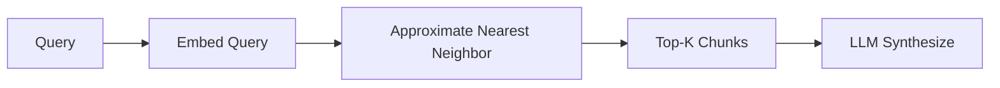
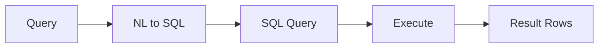
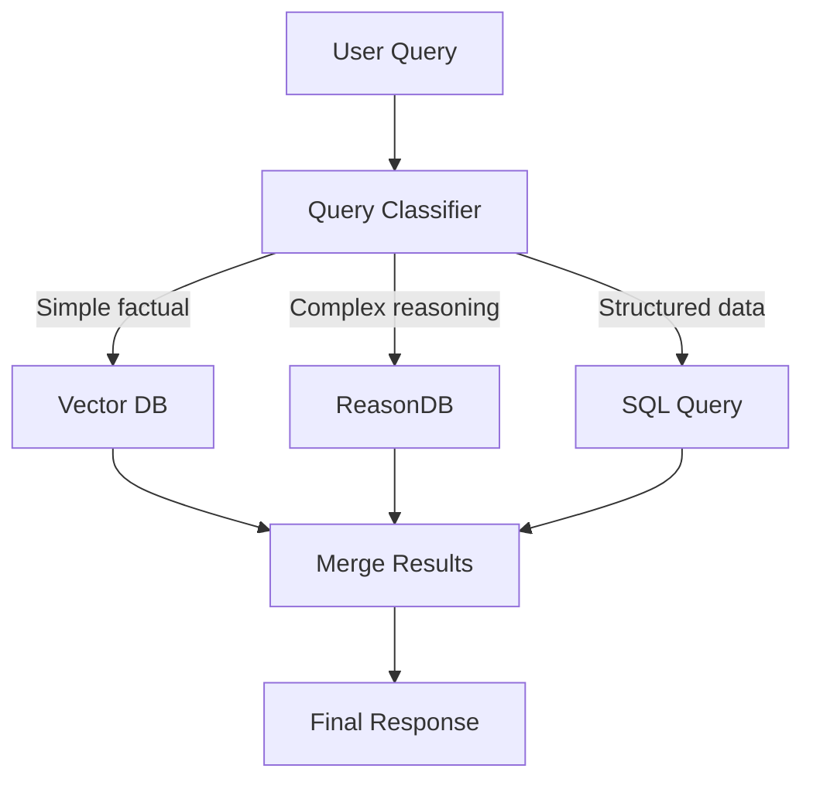

# ReasonDB: Use Cases & Competitive Analysis

> **Why the world needs a Reasoning-Native Database**

---

## 🎯 The Problem with Current Approaches

### The RAG Reality Check

Modern AI applications rely on **Retrieval-Augmented Generation (RAG)** to ground LLM responses in real data. But current approaches have fundamental limitations:

```
User Query: "What was the Q3 revenue breakdown by region for the cloud division?"

Traditional RAG Response:
├── Vector search returns 10 "similar" chunks
├── 3 chunks are about Q3, but Q2 data
├── 2 chunks mention revenue, but for hardware division  
├── 4 chunks are irrelevant marketing content
└── 1 chunk has the answer buried in noise

Result: LLM hallucinates or gives incomplete answer
```

**The core issue:** Vector similarity ≠ Semantic relevance for complex queries.

---

## 🔄 Approach Comparison

### Vector Database (Pinecone, Weaviate, Qdrant)



**How it works:**
- Documents chunked into fixed-size pieces
- Each chunk embedded as a vector (1536 dimensions)
- Query embedded, find closest vectors via cosine similarity
- Return top-k chunks to LLM

**Strengths:**
- ✅ Fast retrieval (milliseconds)
- ✅ Works for simple factual queries
- ✅ No LLM calls during retrieval

**Weaknesses:**
- ❌ "Similar" ≠ "Relevant" for complex queries
- ❌ Loses document structure entirely
- ❌ Cannot reason about relationships
- ❌ Fixed chunk size loses context
- ❌ No way to "navigate" to find information

---

### SQL/Relational Database



**How it works:**
- Data in structured tables with schemas
- Query translated to SQL via LLM
- Exact matching and joins
- Returns precise rows/columns

**Strengths:**
- ✅ Perfect for structured data
- ✅ Exact answers for exact queries
- ✅ Complex joins and aggregations
- ✅ ACID transactions

**Weaknesses:**
- ❌ Cannot handle unstructured text
- ❌ Schema must be known upfront
- ❌ No semantic understanding
- ❌ "Find anything about revenue" is impossible

---

### Graph Database (Neo4j, Amazon Neptune)


**How it works:**
- Entities as nodes, relationships as edges
- Query by traversing connections
- Great for "who knows who" queries

**Strengths:**
- ✅ Relationship-first queries
- ✅ Multi-hop reasoning
- ✅ Flexible schema

**Weaknesses:**
- ❌ Requires entity extraction (expensive)
- ❌ Relationships must be explicitly defined
- ❌ Poor for "find the section about X"
- ❌ Content is secondary to structure

---

### ReasonDB (Reasoning-Native)


**How it works:**
- Documents stored as hierarchical trees
- Each node has LLM-generated summary
- Query triggers tree traversal with LLM decisions
- LLM "navigates" like a human reading a book

**Strengths:**
- ✅ Preserves document structure
- ✅ LLM reasoning at each decision point
- ✅ Can prune irrelevant branches early
- ✅ Handles complex, multi-part queries
- ✅ Explainable: shows reasoning path

**Weaknesses:**
- ⚠️ More LLM calls (but fewer tokens total)
- ⚠️ Slower for simple queries
- ⚠️ Requires upfront summarization cost

---

## 📊 Head-to-Head Comparison

| Capability | Vector DB | SQL DB | Graph DB | **ReasonDB** |
|------------|-----------|--------|----------|--------------|
| Unstructured text | ✅ | ❌ | ⚠️ | ✅ |
| Structured data | ⚠️ | ✅ | ✅ | ✅ |
| Preserves hierarchy | ❌ | ❌ | ⚠️ | ✅ |
| Complex queries | ❌ | ✅ | ✅ | ✅ |
| Semantic search | ✅ | ❌ | ❌ | ✅ |
| Explainable results | ❌ | ✅ | ✅ | ✅ |
| Multi-hop reasoning | ❌ | ⚠️ | ✅ | ✅ |
| Setup complexity | Low | High | High | Medium |
| Query latency | ~10ms | ~50ms | ~100ms | ~2-5s |
| Cost per query | $ | $ | $ | $$$ |

---

## 🌍 Real-World Use Cases

### 1. Legal Document Analysis

**Scenario:** Law firm with 50,000 contracts needs to answer: *"Find all clauses related to liability limitations in technology vendor agreements from 2023"*

**Vector DB Approach:**
```
- Embed query, find similar chunks
- Returns 500 "similar" chunks
- Many are about liability but in employment contracts
- Many are from 2022
- Lawyer must manually filter
- 4 hours of review time
```

**ReasonDB Approach:**
```
Document Tree:
├── Contracts/
│   ├── Technology Vendors/     ← LLM selects this branch
│   │   ├── 2023/               ← LLM selects this branch
│   │   │   ├── AWS Agreement
│   │   │   │   └── Section 8: Liability  ← Found!
│   │   │   ├── Microsoft EA
│   │   │   │   └── Section 12: Limits    ← Found!

Result: 23 relevant clauses, 0 false positives
Time: 45 seconds
```

---

### 2. Financial Research

**Scenario:** Analyst researching: *"How did Apple's services revenue growth compare to hardware in Q3 2024, and what did management say about the outlook?"*

**Vector DB Approach:**
```
- Returns chunks mentioning "Apple", "revenue", "Q3"
- Mixes news articles, analyst reports, earnings calls
- No distinction between facts and opinions
- Cannot connect revenue numbers to management commentary
```

**ReasonDB Approach:**
```
Earnings Call Transcript Tree:
├── Q3 2024 Apple Earnings
│   ├── Financial Results        ← First traversal
│   │   ├── Services Revenue     ← "23% YoY growth"
│   │   └── Hardware Revenue     ← "2% YoY decline"
│   └── Forward Guidance         ← Second traversal
│       └── Services Outlook     ← Management quotes

Result: Structured comparison with sources
```

---

### 3. Technical Documentation Search

**Scenario:** Developer asks: *"How do I configure authentication for the GraphQL API when using microservices with JWT tokens?"*

**Vector DB Approach:**
```
- Returns chunks about:
  - Authentication (REST API docs)
  - GraphQL basics
  - JWT explanation
  - Microservices patterns
- Developer must synthesize across 15 chunks
- Key configuration details buried in noise
```

**ReasonDB Approach:**
```
Documentation Tree:
├── API Reference
│   └── GraphQL                  ← Selected
│       └── Authentication       ← Selected
│           └── JWT Setup        ← Selected
│               └── Microservices Config  ← LEAF: exact answer

Bonus: Returns path showing related docs
```

---

### 4. Medical Records Analysis

**Scenario:** Doctor reviewing patient history: *"Summarize all cardiac-related events and medications for this patient over the past 5 years"*

**Why ReasonDB excels:**
- Medical records have natural hierarchy (visits → diagnoses → treatments)
- Can traverse chronologically
- Summaries at each level provide context
- Can verify relevance before including in response

```
Patient Record Tree:
├── 2024
│   ├── Cardiology Visit (March)  ← Selected
│   │   ├── Diagnosis: AFib
│   │   └── Prescription: Eliquis
│   └── ER Visit (July)           ← Selected
│       └── Event: Palpitations
├── 2023
│   └── Annual Physical
│       └── Note: "elevated BP"   ← Selected
```

---

### 5. Codebase Understanding

**Scenario:** New developer asks: *"How does the payment processing work, and where is the Stripe integration?"*

**ReasonDB with Source Code:**
```
Codebase Tree:
├── src/
│   ├── api/
│   │   └── routes/
│   │       └── payments.rs      ← "Handles /checkout endpoint"
│   ├── services/
│   │   └── payment/
│   │       ├── mod.rs           ← "Payment orchestration"
│   │       ├── stripe.rs        ← "Stripe API client" ✓
│   │       └── processor.rs     ← "Core payment logic"
│   └── models/
│       └── transaction.rs       ← "Payment data structures"

Result: Returns stripe.rs + context of how it's used
```

---

### 6. Customer Support Knowledge Base

**Scenario:** Support agent handling: *"Customer says their enterprise SSO login works in Chrome but fails in Safari with error code E-4012"*

**Traditional search:** Returns all SSO docs, all Safari docs, all error codes

**ReasonDB:**
```
Knowledge Base Tree:
├── Authentication
│   └── SSO
│       └── Enterprise           ← "SSO for business accounts"
│           └── Troubleshooting  ← "Common SSO issues"
│               └── Browser-Specific
│                   └── Safari   ← "Safari SSO quirks"
│                       └── E-4012  ← EXACT SOLUTION

Path provides context: "This is specifically about Enterprise SSO in Safari"
```

---

### 7. Research Paper Analysis

**Scenario:** PhD student asks: *"What datasets were used to evaluate transformer architectures for protein folding, and what were the benchmark results?"*

**ReasonDB with Academic Papers:**
```
Paper: "AlphaFold2: Protein Structure Prediction"
├── Abstract                     ← Quick relevance check
├── Methods
│   └── Datasets                 ← Selected
│       ├── CASP14 Dataset       ← Details + stats
│       └── PDB Training Set     ← Details + stats
├── Results
│   └── Benchmarks               ← Selected
│       ├── GDT Scores           ← Comparison table
│       └── vs. Previous Methods ← Context
```

---

## 💡 When to Use ReasonDB

### ✅ Perfect For:

| Use Case | Why |
|----------|-----|
| **Long documents** (>50 pages) | Hierarchy prevents context overflow |
| **Complex queries** | Multi-step reasoning required |
| **Compliance/Legal** | Need exact provenance and audit trail |
| **Technical docs** | Structure is meaningful |
| **Research** | Need to navigate, not just search |
| **Heterogeneous data** | Mix of PDFs, JSON, code, etc. |

### ⚠️ Consider Alternatives When:

| Scenario | Better Choice |
|----------|---------------|
| Simple factual lookups | Vector DB (faster, cheaper) |
| Highly structured data | SQL (exact queries) |
| Entity relationships | Graph DB (social networks, etc.) |
| Real-time search | Vector DB (lower latency) |
| Cost-sensitive applications | Vector DB (fewer LLM calls) |

---

## 📈 Cost & Performance Analysis

### Token Economics

**100-page document, 10 queries:**

| Approach | Ingestion Tokens | Query Tokens (each) | Total Cost* |
|----------|------------------|---------------------|-------------|
| Vector DB + RAG | 0 | ~8,000 (full chunks) | ~$0.80 |
| ReasonDB | ~15,000 (summaries) | ~2,000 (summaries only) | ~$0.35 |

*At GPT-4o pricing ($2.50/1M input tokens)

**Key insight:** ReasonDB front-loads cost at ingestion but dramatically reduces per-query cost because:
- Only summaries are sent to LLM during traversal
- Irrelevant branches are never read
- Average path: 4-5 nodes × ~200 tokens = ~1,000 tokens

### Latency Breakdown

```
ReasonDB Query (typical):
├── Tree traversal: 4 levels
├── LLM calls: 5 (1 per level + verification)
├── Parallel branches: 2-3 per level
└── Total time: 2-4 seconds

Vector DB Query (typical):
├── Embedding: 50ms
├── ANN search: 10ms
├── LLM synthesis: 1-2 seconds
└── Total time: 1.5-2.5 seconds
```

ReasonDB is ~1-2 seconds slower but delivers **significantly higher accuracy** for complex queries.

---

## 🔮 The Future: Hybrid Approaches

ReasonDB isn't meant to replace everything—it's meant to fill a gap. Future versions will support:



**Intelligent routing:**
- "What is the company's stock ticker?" → Vector DB (fast, simple)
- "Compare the risk factors across all our vendor contracts" → ReasonDB
- "How many orders were placed in December?" → SQL

---

## 🏁 Summary

| Traditional RAG | ReasonDB |
|-----------------|----------|
| Find similar text | Find relevant information |
| Flat chunk retrieval | Hierarchical navigation |
| Hope for the best | Reason through the structure |
| Black box results | Explainable traversal path |
| One-shot retrieval | Iterative refinement |

**ReasonDB brings human-like document navigation to AI systems.**

When you read a 500-page manual, you don't read every page—you:
1. Check the table of contents
2. Navigate to the relevant chapter
3. Scan section headings
4. Read the specific paragraph

ReasonDB teaches AI to do the same.

---

*Document version: 1.0 | January 2026*
