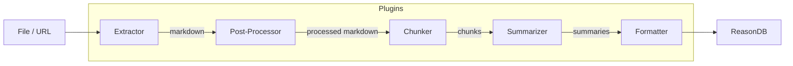

ReasonDB uses a **plugin architecture** for document ingestion. Every pipeline stage — from extracting PDFs to summarizing content — is handled by plugins that communicate via JSON over stdin/stdout.

The built-in `markitdown` plugin ships out of the box and covers most formats. You can override any stage with your own plugin or install community plugins.

## Architecture



Each plugin is an **external process** that:

1. Lives in its own directory under `$REASONDB_PLUGINS_DIR`
2. Declares capabilities in a `plugin.toml` manifest
3. Reads a JSON request from **stdin**
4. Writes a JSON response to **stdout**
5. Exits after handling one request (one-shot model)

## Plugin Types

| Type | Operation | Description |
|------|-----------|-------------|
| `extractor` | `extract` | Convert files or URLs to markdown |
| `post_processor` | `process` | Transform markdown before chunking |
| `chunker` | `chunk` | Split markdown into chunks |
| `summarizer` | `summarize` | Generate summaries for content |
| `formatter` | `format` | Format output nodes |

## Supported Runtimes

Plugins must use one of these runtimes. Other interpreters are rejected at load time to keep the Docker image lean.

| Runtime | `command` value | Notes |
|---------|----------------|-------|
| Python | `python3` or `python` | Included in Docker image |
| Node.js | `node` | Included in Docker image |
| Bash | `bash` or `sh` | Included in Docker image |
| Compiled binary | `./my-binary` or `/abs/path` | Build with Rust, Go, C, etc. and ship the binary |

## Built-in Plugin: MarkItDown

ReasonDB ships with the `markitdown` plugin which wraps [Microsoft MarkItDown](https://github.com/microsoft/markitdown). It handles:

- **Documents**: PDF, Word (.docx), PowerPoint (.pptx), Excel (.xlsx)
- **Web**: HTML pages, URLs, YouTube videos
- **Text**: Plain text, Markdown, CSV, JSON, XML
- **Media**: Images (OCR), Audio (transcription)
- **Archives**: ZIP, EPUB, Outlook (.msg/.eml)

No configuration needed — it's auto-discovered on startup. The `markitdown` plugin has priority `200`, so any custom extractor with a higher priority will take precedence for shared formats.

## Configuration

| Variable | Default | Description |
|---|---|---|
| `REASONDB_PLUGINS_DIR` | `./plugins` | Directory to scan for plugins |
| `REASONDB_PLUGINS_ENABLED` | `true` | Enable/disable plugin system |
| `REASONDB_PLUGIN_TIMEOUT` | `120` | Default timeout in seconds |

## API Endpoints

| Method | Path | Description |
|---|---|---|
| `GET` | `/v1/plugins` | List all discovered plugins |
| `GET` | `/v1/plugins/:name` | Get details for a specific plugin |
| `POST` | `/v1/plugins/:name/test` | Test a plugin with arbitrary input |

```bash
curl http://localhost:4444/v1/plugins
```

## Next Steps

<CardGroup cols={2}>
  <Card title="Plugin Protocol" icon="code" href="/guides/plugins-protocol">
    JSON protocol, manifest format, and request/response shapes
  </Card>
  <Card title="Developing Plugins" icon="wrench" href="/guides/plugins-development">
    Build your own plugins with step-by-step examples
  </Card>
</CardGroup>
